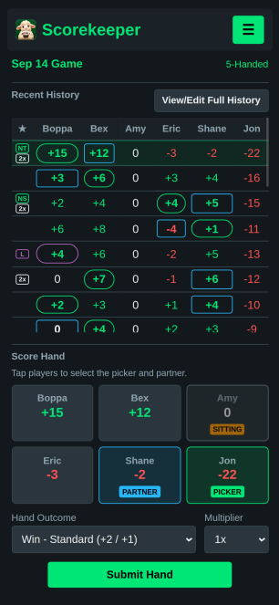
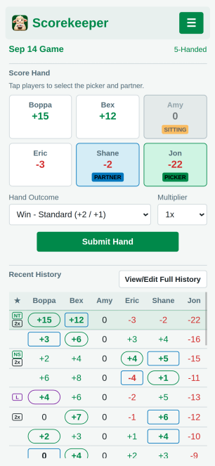
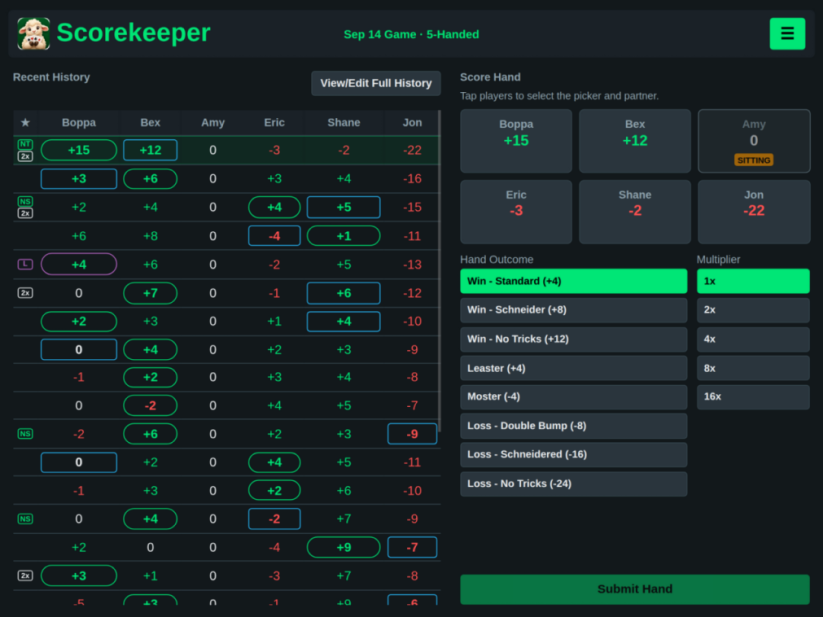
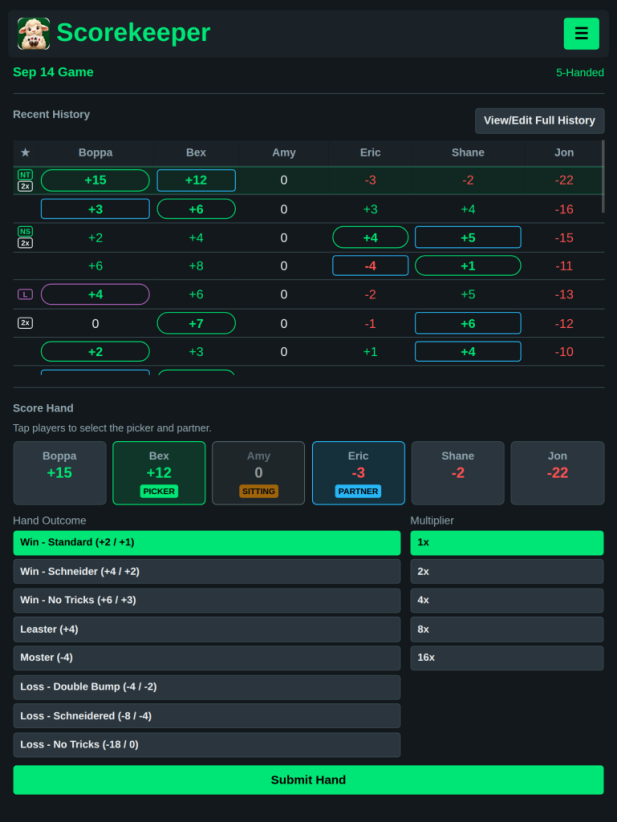
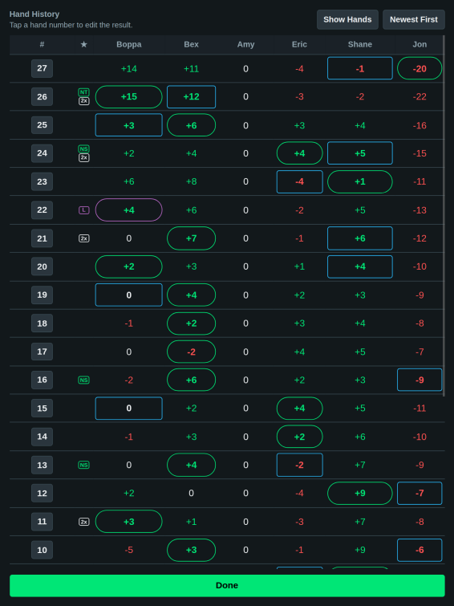

# Sheepshead Scorekeeper

A local-first Sheepshead scoring app designed for quick scorekeeping on phones and tablets. It runs as a static web app on GitHub Pages and can be installed as a Progressive Web App (PWA) for convenient home-screen access and offline use.

## Open The App

**Live app:** https://shubred1.github.io/SheepsheadScoringApp/

## Installing The App

### Android

Open the app in Chrome while online, then use the browser menu and choose **Install app** or **Add to Home screen** when available.

### iPhone And iPad

Open the app in Safari while online, tap **Share**, then choose **Add to Home Screen**.

## How To Use

1. Open the menu and create a new game.
2. Enter a game name, choose the game type, and enter the players.
3. On the **Score Hand** section, tap players to assign the roles needed for the current hand, such as picker, partner, or sitting player(s).
4. Choose the **Hand Outcome** and **Multiplier**.
5. Tap **Submit Hand**.
6. Use **Recent History** to review the latest results.
7. Open **View/Edit Full History** to review all hands and edit a previous hand if needed.

The current scores are shown with the player cards as the game progresses.

## Games And Players

The app supports multiple saved games on the same device/browser.

From the menu you can:

- create a new game
- switch between saved games
- change the active game's name and settings
- reorder players
- add players when supported by the selected game type
- mark a player as **Sit indefinitely**
- undo the most recently submitted hand

Player order represents seating order. Historical hands remain associated with the correct players when the seating order changes.

## Hand History

### Recent History

The main scoring screen includes a simplified Recent History view for quickly checking the latest scores.

### Full History

Use **View/Edit Full History** to:

- view all recorded hands
- switch between hand results and running totals
- view newest or oldest hands first
- tap a hand number to edit a previously recorded hand

Editing a previous hand recalculates the scores without changing the later hand sequence.

## Preferences

Open **Preferences** from the menu to adjust app-level display options.

Available preferences include:

- **Theme** — light or dark appearance
- **Hand History Position** — Auto, Top, or Bottom for stacked layouts
- **Tablet Landscape** — Auto, Left, or Right for choosing which side Recent History appears on in the tablet landscape layout

On supported tablet-sized landscape screens, the app uses a two-column layout so scoring controls and Recent History can remain visible together.

## Saved Data And Offline Use

Scores, player names, settings, and theme preference are saved locally on the device/browser with `localStorage`. They are not synced between devices or browsers.

Visit and load the app once while online before relying on offline use. After that first successful load, the app shell is cached so it can open and run without an internet connection.

Because game data is stored locally, clearing the browser/app's site data can remove saved games.

## Screenshots

### Phone
<!--

  
  

-->

<table align="center">
  <tr>
    <td align="center">
      <strong>Dark theme, hand history at top</strong>
       
      
    </td>
    <td align="center">
      <strong>Light theme, hand history at bottom</strong>
       
      
    </td>
  </tr>
</table>

### Tablet Landscape

<!--  -->

  

### Tablet Portrait

<!--  -->

  

### Hand History Screen

<h3 align="center">View and/or Edit the hand history</h3>

  

## Development

The app is intentionally lightweight and is built with static HTML, CSS, and JavaScript.

The normal branch workflow is:

- `main` — production / GitHub Pages
- `dev` — ongoing development

Developer documentation is available in:

- [AGENTS.md](AGENTS.md)
- [PROJECT_STATUS.md](PROJECT_STATUS.md)
- [docs/](docs/)

These files contain architecture, data-model, scoring, product-decision, and PWA notes.
